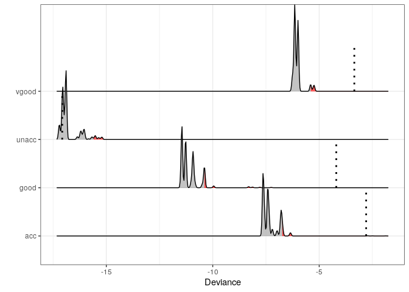
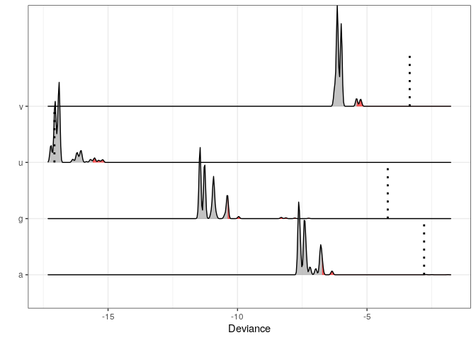

molic: Multivariate OutLIerdetection In Contingency tables
================

<!-- README.md is generated from README.Rmd. Please edit that file -->
[](https://travis-ci.com/mlindsk/molic) [](https://ci.appveyor.com/project/mlindsk/molic) [](https://joss.theoj.org/papers/9fa65ced7bf3db01343d68b4488196d8) [](https://zenodo.org/badge/latestdoi/177729633)

About molic
-----------

An **R** package to perform outlier detection in contingency tables using decomposable graphical models (DGMs); models for which the underlying association between all variables can be depicted by an undirected graph. **molic** also offers algorithms for fitting undirected decomposable graphs. Compute-intensive procedures are implemented using [Rcpp](http://www.rcpp.org/)/C++ for better run-time performance.

Getting Started
---------------

If you want to learn the "behind the scenes" of the model it is recommended to go through [The Outlier Model](https://mlindsk.github.io/molic/articles/) and look at the [documentation](https://mlindsk.github.io/molic/reference/index.html) as you read along. See also the examples below and the software paper.

You can install the current stable release of the package by using the `devtools` package:

``` r
devtools::install_github("mlindsk/molic", build_vignettes = FALSE)
```

The development version can be installed using (see e.g. the `NEWS.md` file at the develop branch to get a feeling of the upcoming features):

``` r
devtools::install_github("mlindsk/molic@develop", build_vignettes = FALSE)
```

How To Cite
-----------

-   If you want to cite the **outlier method** please use

``` latex
@article{lindskououtlier,
  title={Outlier Detection in Contingency Tables Using Decomposable Graphical Models},
  author={Lindskou, Mads and Svante Eriksen, Poul and Tvedebrink, Torben},
  journal={Scandinavian Journal of Statistics},
  publisher={Wiley Online Library},
  doi={10.1111/sjos.12407},
  year={2019}
}
```

-   If you want to cite the **molic** package please use

``` latex
@software{lindskoumolic,
  author       = {Mads Lindskou},
  title        = {{molic: An R package for multivariate outlier 
                   detection in contingency tables}},
  month        = oct,
  year         = 2019,
  publisher    = {Journal of Open Source Software},
  doi          = {10.21105/joss.01665},
  url          = {https://doi.org/10.21105/joss.01665}
}
```

Main Functions
--------------

The main functions in **molic** are

-   `fit_graph` which fits a decomposable graph. It has four types; forward selection (`fwd`), backward selection (`bwd`), tree (`tree`) and a combination of tree and forward (`tfwd`). Using `adj_lst` on an object returned by `fit_graph` gives the **adjacency list** corresponding to the graph. Similarly one can use `adj_mat` to obtain an adjacency matrix.
-   `fit_outlier` which can be used to test if an observation is an outlier in some categorical data. It needs an adjacency list as input which can be obtained from an object returned by `fit_graph`.

Adjacency lists are important in **molic**. They are named `list` objects of the form

``` r
adj <- list(a = "b", b = c("a", "c"), c = "b", d = character(0))
```

We can plot the corresponding graph by creating a `gengraph` object as

``` r
d <- data.frame(a = "", b = "", c = "", d = "") # A dummy dataframe
g <- gengraph(d, type = "gen", adj)
plot(g)
```

 The dummy `data.frame` `d` is needed as an argument. This is because, in almost all cases a `gengraph` object is obtained from `fit_graph` which uses a `data.frame` to fit the graph. Notice, that **isolated** nodes (here `d`) is formed using the empty character `character(0)`.

Finally, since the `fit_outlier` function assumes that `adj` is **decomposable** (the graph cannot have cycles of length greater than 4 without a chord) we can test for this explicitly

``` r
is_decomposable(adj)
#> [1] TRUE
```

This can be useful, if the user has obtained an adjacency list using some other software than `fit_graph`. The `fit_outlier` will also raise a warning if the graph (`adj`) is not decomposable.

Example - Outlier Detection
---------------------------

To demonstrate the outlier method we use the `car` data set from the [UCI Machine Learning Repository](https://archive.ics.uci.edu/ml/index.php). The data have 4 classes that labels the evaluation of a car; `unacceptable, acc, vgood` and `good`. These classes are determined by the other variables in the data - and theses are *not* necessarily independent of each other and we must therefore "fit their association".

### Reading Data

``` r
library(dplyr)
car <- read.table("https://archive.ics.uci.edu/ml/machine-learning-databases/car/car.data",
  header = FALSE, sep = ",", dec = ".") %>%
  as_tibble() %>% 
  mutate_all(as.character)

colnames(car) <- c("buying", "maint", "doors", "persons", "lug", "safety", "class")
car_class <- car %>%
  select(class) %>%
  mutate(class = case_when(
    class == "unacc" ~ "u",
    class == "acc"   ~ "a",
    class == "vgood" ~ "v",
    class == "good"  ~ "g"
  ))

car <- car %>%
  select(-class) %>%
  to_single_chars() %>% # The outlier model assumes that all values are single characters!
  as_tibble() %>%
  bind_cols(car_class)
```

### Defining Sub-Classes

``` r
vgood_cars <- car %>%
  filter(class == "v") %>%
  select(-class)

unacc_cars <- car %>%
  filter(class == "u") %>%
  select(-class)
```

### A New Observation

We imagine that a new observation is given; here we take a random observation from the `unacc` class.

``` r
set.seed(7)
z <- sample_n(unacc_cars, 1) %>% unlist()
```

### Outlier Test

Now we test if `z` is an outlier in `vgood_cars`.

``` r
m <- fit_outlier(as.matrix(vgood_cars), z, trace = FALSE)
print(m)
#> 
#>  -------------------------------- 
#>   Simulations: 10000 
#>   Variables: 6 
#>   Observations: 66 
#>   Estimated mean: -6.04 
#>   Estimated variance: 0.05 
#>     ---------------------------   
#>   Critical value: -5.40171 
#>   Deviance: -3.350997 
#>   P-value: 0 
#>   Alpha: 0.05 
#>   <outlier, outlier_model, list> 
#>  --------------------------------
```

Thus the car is declared an outlier on a 0.05 significance level. We can visualize this by plotting the corresponding density of the deviance statistic as

``` r
plot(m)
#> Picking joint bandwidth of 0.0167
```

 and verify that the estimated deviance of the selected car is -3.3509971 (the dotted line) which is larger than the critical value of -5.4017104. The red area represents the significance level (here *α* = 0.05).

Multiple Tests
--------------

Here we make a test for `z` being an outlier i all four different car classes (the hypothesis are exclusive so no need for multiple hypothesis correction). The red areas are the significance levels (here *α* = 0.05) and the dotted lines represents the observed deviance of `z` within the respective outlier test. We see that `z` is rejected in all but the true class of `z`. The odd looking densities is due to the fact that `car` does not contain that many variables. See other examples in the documentation of the vignettes.

``` r
mm <- fit_multiple_models(as.matrix(car), z, response = "class", alpha = 0.05)
#> 1 / 4  ... 
#> 2 / 4  ... 
#> 3 / 4  ... 
#> 4 / 4  ...
plot(mm)
#> Picking joint bandwidth of 0.0341
```



Example - Variable Selection
----------------------------

The `fit_graph` procedure can be used as a variable selection tool. The idea is, to fit an interaction graph with the class variable of interest included. The most influential variables on the class variable is then given by the neighboring variables. Lets investigate which variables influences how the cars are labelled.

``` r
G_car <- fit_graph(car, trace = FALSE)
plot(G_car)
```


So the class of a car is actually determined by all variables except for `doors` (the number of doors in the car). The neighbors of `class` can be extracted as follows

``` r
adj_lst(G_car)$class
#> [1] "safety"  "persons" "buying"  "maint"   "lug"
```

We can also state e.g. that the `safety` of a car is independent of the price (the `buying` varible) when the class of the car is known; this phenomena is also known as *conditional independence*.
