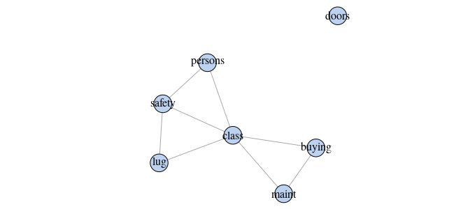

molic: Multivariate OutLIerdetection In Contingency Tables
================

<!-- README.md is generated from README.Rmd. Please edit that file -->
[](https://travis-ci.com/mlindsk/molic) [](https://ci.appveyor.com/project/mlindsk/molic)

About molic
-----------

An **R** package to perform outlier detection in contingency tables using decomposable graphical models (DGMs); models for which the underlying association between all variables can be depicted by an undirected graph. **molic** also offers algorithms for fitting undirected decomposable graphs. Compute-intensive procedures are implementet using [Rcpp](http://www.rcpp.org/)/C++ for better run-timer performance.

Getting Started
---------------

If you want to learn the "behind the scenes" of the model it is recommended to go through [The Outlier Model](https://mlindsk.github.io/molic/articles/) and look at the [documentation](https://mlindsk.github.io/molic/reference/index.html) as you read along. See also the examples below and the paper \[TBA\].

Installation
------------

You can install the development version of the package by using the `devtools` package:

``` r
# devtools::install_github("mlindsk/molic", build_vignettes = TRUE)
```

Main Functions
--------------

A list of some core functions in the **molic** package is listed below

<table style="width:67%;">
<colgroup>
<col width="25%" />
<col width="41%" />
</colgroup>
<thead>
<tr class="header">
<th align="left">Function</th>
<th align="left">Description</th>
</tr>
</thead>
<tbody>
<tr class="odd">
<td align="left"><code>outlier_model</code></td>
<td align="left">Fits an outlier detection model</td>
</tr>
<tr class="even">
<td align="left"><code>p_val</code></td>
<td align="left">Calculates the p-value of an observation being an outlier</td>
</tr>
<tr class="odd">
<td align="left"><code>efs</code></td>
<td align="left">Fits a decomposable graph using forward selection.</td>
</tr>
<tr class="even">
<td align="left"><code>cl_tree</code></td>
<td align="left">Fits a tree (decomposable graph) using the Chow-Liu method.</td>
</tr>
</tbody>
</table>

Example - Outlier Detection
---------------------------

To demonstrate the outlier method we use the `car` data set from the [UCI Machine Learning Repository](https://archive.ics.uci.edu/ml/index.php). The data have 4 classes that labels the evaluation of a car; `unacceptable, acc, vgood` and `good`. These classes are determined by the other variables in the data - and theses are *not* necessarily independent of each other and we must therefore "fit their association".

### Reading data

``` r
library(dplyr)
#> 
#> Attaching package: 'dplyr'
#> The following objects are masked from 'package:stats':
#> 
#>     filter, lag
#> The following objects are masked from 'package:base':
#> 
#>     intersect, setdiff, setequal, union
car <- read.table("https://archive.ics.uci.edu/ml/machine-learning-databases/car/car.data",
  header = FALSE, sep = ",", dec = ".") %>%
  as_tibble() %>%
  mutate_all(as.character)

colnames(car) <- c("buying", "maint", "doors", "persons", "lug", "safety", "class")
```

### Defining subclasses

``` r
vgood_cars <- car %>%
  filter(class == "vgood") %>%
  select(-class) %>%
  mutate_all(.funs = function(x) substr(x, 1, 1)) # All values _must_ be a single character!

unacc_cars <- car %>%
  filter(class == "unacc") %>%
  select(-class) %>%
  mutate_all(.funs = function(x) substr(x, 1, 1))
```

### Fitting an interaction graph

    #> 
    #> Attaching package: 'molic'
    #> The following object is masked from 'package:stats':
    #> 
    #>     deviance

Fit the interaction graph for the `vgood` cars and plot the result.

``` r
G_vgood  <- efs(vgood_cars, p = 0, trace = FALSE) # adj_list(efs(vgood_cars, p = 0, trace = FALSE))
plot(G_vgood)
```


For comparison we also fit the interaction graph for the `unacc_cars`

``` r
G_unacc  <- efs(unacc_cars, p = 0, trace = FALSE)
plot(G_unacc)
```


It is apparent that very good cars and unacceptable cars are determined by two different mechanisms.

### Outlier test

We randomly select five cars from the `unacc_cars` data and test if they are outliers in `vgood_cars`.

``` r
set.seed(7)
# Five random observations from the unacc_cars data
zs    <- sample_n(unacc_cars, 5)

# A vector indicating whether not each of the 5 observations is an outlier in vgood_cars
outs  <- vector(length = 5)

# The result
sapply(seq_along(outs), function(i) {
  z   <- unlist(zs[i, ])
  # Include z in vgood_cars (the hypothesis is, that z belongs here)
  D_z <- as.matrix(vgood_cars %>% bind_rows(z))
  M   <- outlier_model(D_z, adj_list(G_vgood), nsim = 5000)
  p   <- p_val(M, deviance(M, z))
  ifelse(p <= 0.05, TRUE, FALSE)  # significance level = 0.05 used
})
#> [1] TRUE TRUE TRUE TRUE TRUE
```

All five randomly selected cars are thus declared outliers on a 0.05 significance level.

Example - Variable Selection
----------------------------

The `efs` procedure can be used as a variable selection tool. The idea is, to fit an interaction graph with the class variable of interest included. The most influential variables on the class variable is then given by the neighboring variables. Lets investigate which variables influences how the cars are labelled.

``` r
G_car <- efs(car, trace = FALSE)
plot(G_car)
```

 So the class of a car is actually determined by all variables except for `doors` (the number of doors in the car). The neighbors of `class` can be extracted as follows

``` r
adj_list(G_car)$class
#> [1] "safety"  "persons" "buying"  "maint"   "lug"
```

We can also state e.g. that the `safety` of a car is independent of the price (the `buying` varible) when the class of the car is known; this phenomena is also known as *conditional independence*.

<!-- ## Example - Specify a Priori Knowledge -->
<!-- If you know some relations between variables in advance it is possible to take this into account before fitting the graph. Assume, that we know the `doors` variable is associated with the `class` variable. We could then initialize an adjacency list with this information as follows. -->
<!-- # A variable with no neighbors have value = character(0) -->
<!-- ## adj <- lapply(colnames(car), function(x) character(0)) -->
<!-- ## names(adj) <- colnames(car) -->
<!-- ## adj$class <- "doors" -->
<!-- ## X <- as_efs(car, adj) -->
<!-- ## X$G_adj -->
<!-- ## ls(envir = X$ht) -->
<!-- ## ls(envir = cl_tree(car)$ht) -->
<!-- ## efs(df, cl_tree(car)) -->
<!-- ## efs(car, as_efs(car, adj)) -->
How To Cite
-----------

TBA
